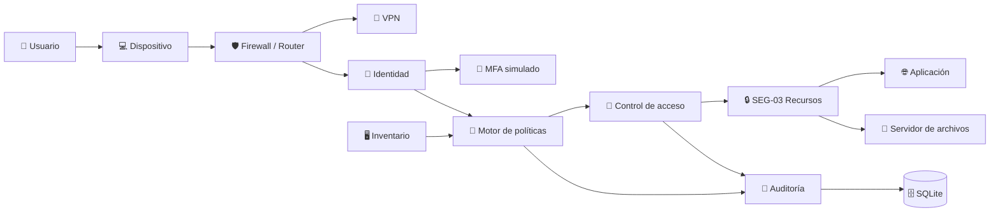

# 🛡️ Laboratorio Zero Trust para MiPymes

<p align="center">
  <strong>Prototipo académico de laboratorio para demostrar principios de Zero Trust</strong>
</p>

<p align="center">
  <a href="#-descripción">Descripción</a> •
  <a href="#-funcionalidades">Funcionalidades</a> •
  <a href="#-arquitectura">Arquitectura</a> •
  <a href="#-instalación">Instalación</a> •
  <a href="#-pruebas">Pruebas</a> •
  <a href="#-estructura">Estructura</a> •
  <a href="#-limitaciones">Limitaciones</a>
</p>

<p align="center">
  
  
  
  
  
</p>

---

## 🎯 Descripción

Este proyecto presenta un **laboratorio académico de arquitectura Zero Trust** orientado al contexto de las MiPymes de Santiago de Cali, Colombia.

El prototipo permite demostrar que una solicitud de acceso no debe depender únicamente de una identidad y una contraseña, sino que debe evaluarse considerando múltiples condiciones de contexto:

```text
Identidad
   ↓
MFA
   ↓
Dispositivo
   ↓
Rol
   ↓
Recurso
   ↓
Segmento
   ↓
Política
   ↓
Decisión
   ↓
Auditoría
```

La aplicación está diseñada para ejecutarse **localmente**, con información simulada y controles simplificados para fines académicos.

> ⚠️ **Importante:** este proyecto es un laboratorio controlado. No constituye una plataforma empresarial lista para producción y no debe conectarse a sistemas reales ni a infraestructuras de terceros.

---

## ✨ Funcionalidades

| Módulo              | Descripción                                               |
| ------------------- | --------------------------------------------------------- |
| 👤 Usuarios y roles | Gestión y consulta de identidades y roles de demostración |
| 🔐 MFA              | Simulación del segundo factor de autenticación            |
| 💻 Dispositivos     | Estado, autorización, postura y asociación con usuarios   |
| 📁 Recursos         | Aplicaciones, archivos y bases de datos protegidas        |
| 🧠 Políticas        | Reglas de decisión y control de acceso                    |
| 🚦 Evaluación       | Decisión `PERMITIDO` o `DENEGADO`                         |
| 📝 Auditoría        | Registro de solicitudes, motivos y tiempos de decisión    |
| 📊 Dashboard        | Indicadores y eventos recientes                           |
| 🧪 Escenarios       | Casos positivos y negativos para demostración             |
| 🗺️ Arquitectura    | Visualización conceptual del flujo Zero Trust             |

---

## 🧩 Stack tecnológico

**Backend**

* Python
* Flask
* SQLite

**Frontend**

* HTML5
* CSS3
* JavaScript

**Modelamiento y documentación**

* Mermaid
* Markdown

**Pruebas**

* Pytest

---

## 🏗️ Arquitectura



### Flujo de evaluación

1. Identificar el usuario.
2. Comprobar el estado de la cuenta.
3. Validar MFA.
4. Verificar el dispositivo.
5. Comprobar autorización y postura.
6. Validar el rol frente al recurso.
7. Validar el segmento lógico.
8. Aplicar las condiciones de política.
9. Tomar la decisión.
10. Registrar la solicitud en auditoría.

---

## 🖥️ Interfaz

La aplicación contiene un panel web con las siguientes vistas:

```text
Dashboard
Laboratorio Zero Trust
Usuarios y roles
Dispositivos
Recursos protegidos
Políticas
Auditoría
Escenarios de prueba
Arquitectura
```

### 📸 Evidencias visuales

> Reemplaza los siguientes bloques por capturas reales del proyecto antes de publicar el repositorio.

**Dashboard**

`[ CAPTURA: panel principal con indicadores y últimos eventos ]`

**Evaluación de acceso**

`[ CAPTURA: escenario CP-01 mostrando DECISIÓN: PERMITIDO ]`

**Denegación por MFA**

`[ CAPTURA: CP-02 mostrando MFA inválido y DECISIÓN: DENEGADO ]`

**Denegación por permisos**

`[ CAPTURA: CP-03 mostrando rol insuficiente ]`

**Denegación por dispositivo**

`[ CAPTURA: CP-04 mostrando dispositivo no autorizado ]`

**Auditoría**

`[ CAPTURA: tabla de eventos con resultado, motivo, política y tiempo de decisión ]`

---

## 🧪 Escenarios de prueba

| ID    | Escenario                                         | Resultado esperado |
| ----- | ------------------------------------------------- | ------------------ |
| CP-01 | Usuario, MFA, dispositivo, rol y segmento válidos | ✅ `PERMITIDO`      |
| CP-02 | MFA incorrecto                                    | ❌ `DENEGADO`       |
| CP-03 | Rol sin privilegios suficientes                   | ❌ `DENEGADO`       |
| CP-04 | Dispositivo no autorizado                         | ❌ `DENEGADO`       |
| CP-05 | Usuario suspendido                                | ❌ `DENEGADO`       |
| CP-06 | Registro de auditoría                             | ✅ Evento creado    |
| CP-07 | Segmento no autorizado                            | ❌ `DENEGADO`       |
| CP-08 | Dispositivo revocado o bloqueado                  | ❌ `DENEGADO`       |

### Caso adicional de control

También se contempla una validación para impedir que un usuario utilice un dispositivo asociado a otra identidad:

```text
Ana Rodríguez
       +
PC-ADM-001
       ↓
   DENEGADO
       ↓
El dispositivo no pertenece
al usuario seleccionado
```

---

## 🚀 Instalación

### 1. Clonar el repositorio

```bash
git clone <URL_DEL_REPOSITORIO>
cd zero-trust-lab
```

### 2. Crear el entorno virtual

```bash
python -m venv .venv
```

### 3. Activar el entorno

**Windows PowerShell**

```powershell
.venv\Scripts\activate
```

**Linux / macOS**

```bash
source .venv/bin/activate
```

### 4. Instalar dependencias

```bash
python -m pip install --upgrade pip
pip install -r requirements.txt
```

### 5. Ejecutar las pruebas

```bash
pytest -q
```

### 6. Iniciar la aplicación

```bash
python backend/app.py
```

### 7. Abrir el laboratorio

Visita:

```text
http://127.0.0.1:5000
```

La base de datos local se genera automáticamente en:

```text
database/zero_trust.db
```

---

## 📁 Estructura del proyecto

```text
zero-trust-lab/
│
├── backend/
│   └── app.py
│
├── database/
│   └── .gitkeep
│
├── diagrams/
│   └── architecture.mmd
│
├── documentation/
│   └── technical-notes.md
│
├── frontend/
│   └── templates/
│       └── index.html
│
├── tests/
│   └── test_policy.py
│
├── .gitignore
├── README.md
└── requirements.txt
```

---

## 🔍 Modelo de datos

El laboratorio trabaja con cinco entidades principales:

```text
┌─────────────┐
│    Users    │
└──────┬──────┘
       │
       ▼
┌─────────────┐
│   Devices   │
└─────────────┘

┌─────────────┐
│  Resources  │
└─────────────┘

┌─────────────┐
│  Policies   │
└─────────────┘

┌─────────────┐
│ AuditEvents │
└─────────────┘
```

Estas entidades permiten relacionar identidad, dispositivo, recurso, política y trazabilidad.

---

## 📊 ¿Qué demuestra el laboratorio?

El prototipo permite observar de forma práctica que:

* una identidad activa por sí sola no garantiza acceso;
* MFA interviene en la decisión;
* el estado y postura del dispositivo importan;
* el rol debe ser compatible con el recurso solicitado;
* el segmento lógico forma parte del contexto;
* las solicitudes pueden permitirse o bloquearse;
* cada decisión genera trazabilidad en la auditoría.

El objetivo no es presentar una infraestructura corporativa completa, sino **demostrar la lógica de evaluación contextual de acceso** en un entorno controlado.

---

## 🛡️ Consideraciones de seguridad

Este repositorio debe utilizarse únicamente con:

* datos ficticios;
* usuarios de demostración;
* infraestructura local;
* `127.0.0.1`;
* escenarios controlados.

No utilices este laboratorio para:

```text
❌ Sistemas productivos
❌ Direcciones externas
❌ Infraestructura de terceros
❌ Credenciales reales
❌ Datos personales reales
```

---

## ⚠️ Limitaciones

El proyecto conserva deliberadamente algunas simplificaciones propias de un laboratorio académico:

* el MFA es simulado;
* SQLite se utiliza como almacenamiento local;
* la segmentación se representa lógicamente;
* no existe integración con un proveedor de identidad empresarial;
* no existe integración con un SIEM;
* no se incluyen usuarios reales;
* no se ejecutan pruebas ofensivas sobre infraestructuras externas.

Estas restricciones forman parte del alcance académico del prototipo.

---

## 🧭 Evolución propuesta

```text
Laboratorio académico
        │
        ▼
Diagnóstico con MiPyme
        │
        ▼
Piloto controlado
        │
        ▼
MFA / IAM real
        │
        ▼
Segmentación de red
        │
        ▼
Observabilidad / SIEM
        │
        ▼
Madurez empresarial
```

### Próximas mejoras

* Integración con un proveedor IAM real.
* MFA basado en un servicio externo.
* Gestión CRUD completa de entidades.
* Políticas completamente parametrizables.
* Segmentación mediante infraestructura de red.
* Integración con plataformas de observabilidad.
* Gestión de sesiones y revocaciones.
* Métricas históricas y reportes.
* Controles adicionales de seguridad de API.

---

## 📚 Relación con el proyecto académico

Este repositorio acompaña el proyecto integrador de grado:

> **Modelo de adopción progresiva de Zero Trust para fortalecer la ciberseguridad de las MiPymes de Cali**

**Universidad Santiago de Cali**
**Facultad de Ingeniería**
**Programa de Ingeniería de Sistemas**
**Estudiante:** Jhames Hernando Plaza Luna
**Año:** 2026

---

## 👨‍💻 Autor

**Jhames Hernando Plaza Luna**
Ingeniería de Sistemas
Universidad Santiago de Cali

---

## 📜 Referencia conceptual

La propuesta toma como referencia el enfoque de **Zero Trust Architecture** documentado por el National Institute of Standards and Technology (NIST), particularmente la idea de no otorgar confianza implícita y evaluar las solicitudes de acceso según el contexto.

> **No confiar implícitamente; verificar cada solicitud de acceso.**

---

<p align="center">
  <strong>🛡️ Zero Trust Laboratory · Academic Project · 2026</strong>
</p>
